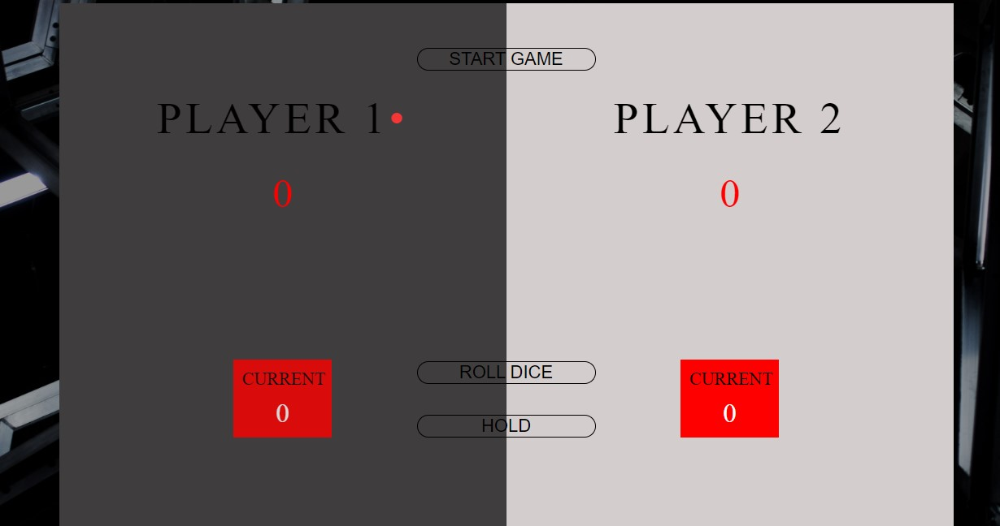
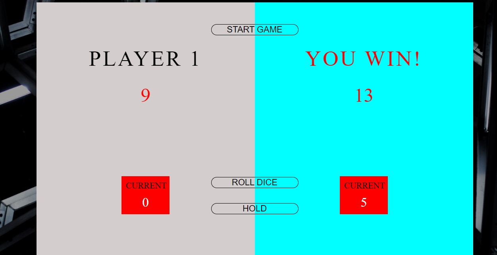

# Pig-dice-game - A game for two players

I created this game following the tutorial by Jonas Schmedtmann.

## Table of contents

- [Overview](#overview)
  - [The game](#the-game)
  - [Example](#example)
  - [Links](#links)
- [Author](#author)

## Overview

### The game

Each turn, a player repeatedly rolls a die until either a 0 is rolled or the player decides to "hold":

- If the player rolls a 0, they score nothing and it becomes the next player's turn.

- If the player rolls any other number, it is added to their turn total and the player's turn continues.
- If a player chooses to "hold", their turn total is added to their score, and it becomes the next player's turn.

The first player to score 100 or more points wins.

### Example

The first player, Teni , begins a turn with a roll of 5. Teni could hold and score 5 points, but chooses to roll again. Teni rolls a 2, and could hold with a turn total of 7 points, but chooses to roll again. Teni rolls a 0, and must end her turn without scoring. The next player, James, rolls the sequence 4-5-3-5-6, after which he chooses to hold, and adds his turn total of 23 points to his score.
(This game is only fit for desktop. The mobile design is still in progress)

### Links

- Solution URL: [Github](https://github.com/KemiDoyin/Pig-dice-game)
- Live Site URL: [https://pigdicegame-bykemi.netlify.app/](https://pigdicegame-bykemi.netlify.app/)

## Author

- Website - [https://kemiadedoyin-ka.netlify.app/](https://kemiadedoyin-ka.netlify.app/)
- Frontend Mentor - [@KemiDoyin](https://www.frontendmentor.io/profile/KemiDoyin)
- Twitter - [@KemiAdedoyin_](https://twitter.com/KemiAdedoyin_)

If you find this interesting, do give this repository a star :star:

